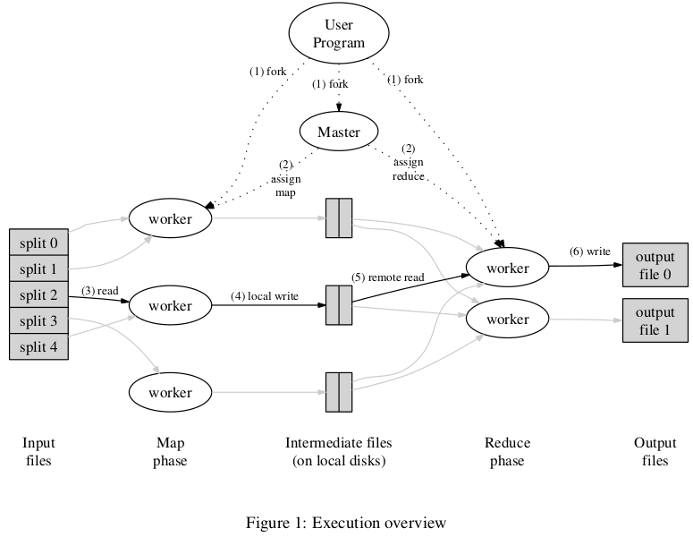

## MapReduce: Simplified Data Processing on Large Clusters

### Abstract
MapReduce is a programming model for processing large datasets.

It is based on an abstraction that provides the map and reduce operations allows to distribute and parallelize large computations.

The runtime takes care of the details of partitioning the input data, scheduling the program's execution across a set of machines, handling machine fauilures, and managing the required inter-machine communication.

### Introduction
The input data is usually large and the computations have to be distributed across multiple machines in order to finish in a reasonable amount of time.

The MapReduce abstraction hides details of parallelization, fault tolerance, data distribution and load balancing. Computations that involve applying a map operation to each logical record in the input in order to compute a set of intermediary key/value pairs, and then applying a reduce operation that share the same key. 

### Programming Model
The computation takes a set of input key/value pairs, and produces a set of output key/value pairs. 
Map: Takes an input pair and produces a set of intermediary key/value pairs.

Reduce: Accepts an intermediary key I and a set of values for that key. It merges together these values to form a possibly smaller set of values.

### Execution Overview
 

The _Map_ invocations are distributed across multiple machines by automatically partitioning the input data into a set of M splits. The input splits can be processed in parallel by different machines. _Reduce_ invocations are distributed by partitioning the intermediate key spaces into R pieces using a partitioning function (eg. hash(key) mod R). The number of partitions (R) and the partitioning function are specifid by the user.

### Fault tolerance
The master pings every worker periodically.
Re-execution as the primary mechanism for fault tolerance.
The master write periodic checkpoints of the master data structures

### Locality
GFS divides each file into 64MB blocks, and stores several copies of each block (typically 3 copies) on different machines.

### Task Granularity
We subdivide the map phase into M pieces and the reduce phase into R pieces. Ideally, M and R should be much large than the number of worker machines.

### Questions
